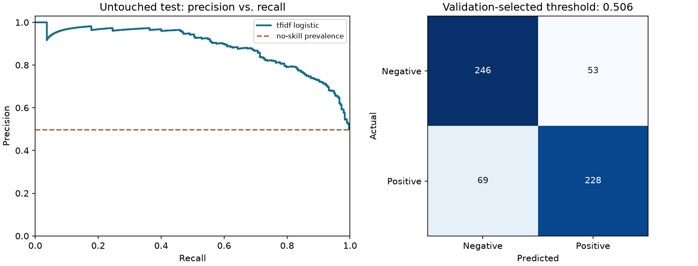

# Sentiment Analysis — reproducible results

Benchmark positive/negative sentiment against UCI's human-labelled review sentences. Training-only TF-IDF and logistic regression are evaluated against an independent holdout. VADER additionally scores unlabelled social posts as positive, negative, or neutral.

## Evaluation design

Seed 42. Training, validation, and test row counts: 1,787,
596, 596.
Preprocessing is fitted inside the training pipeline. Model selection uses validation
average_precision; the decision threshold maximizes validation F1.
The selected model is **tfidf_logistic**. No tuning uses the test labels.

## Untouched test results

| Measure | Selected model | Constant-prevalence baseline |
|---|---:|---:|
| Average precision | 0.8873 | 0.4983 |
| ROC AUC | 0.8860 | 0.5000 |
| Log loss (lower is better) | 0.4730 | 0.6931 |
| Brier score (lower is better) | 0.1509 | 0.2500 |
| Precision | 0.8114 | 0.0000 |
| Recall | 0.7677 | 0.0000 |
| F1 | 0.7889 | 0.0000 |
| Accuracy | 0.7953 | 0.5017 |

At threshold **0.5058**, the model produces **281** positive flags:
**228** true positives and **53** false positives.
It misses **69** positives; **246** negatives are correctly rejected.
Test positive prevalence is **49.83%**, across 596 rows.

## Interpretation and limits

The VADER baseline abstained as neutral on 123 of 596 held-out sentences (coverage 79.4%); see `vader_benchmark.json` for accuracy with its denominator explicitly stated. Training a classifier to reproduce VADER labels would measure agreement with a rule system, not accuracy against human sentiment. This workflow instead uses human labels. `errors.csv` exposes model failures, and `source_breakdown.csv` separates Amazon, IMDb, and Yelp performance. The benchmark intentionally contains only positive/negative sentences, so it cannot validate neutral detection. Reviews differ from Black Friday tweets; no claim of measured Black Friday public opinion is made. `example_sentiments.csv` scores eight authored illustrative posts, not collected social-media observations. Sarcasm, mixed sentiment, language shifts, and domain shifts remain limitations.

See [all candidate metrics](metrics.csv), [auditable test predictions](predictions.csv),
[split assignments](splits.csv), and [run metadata, input hash, and package versions](metrics.json).
Numbers here are generated by the script, not copied from the historical notebook.
