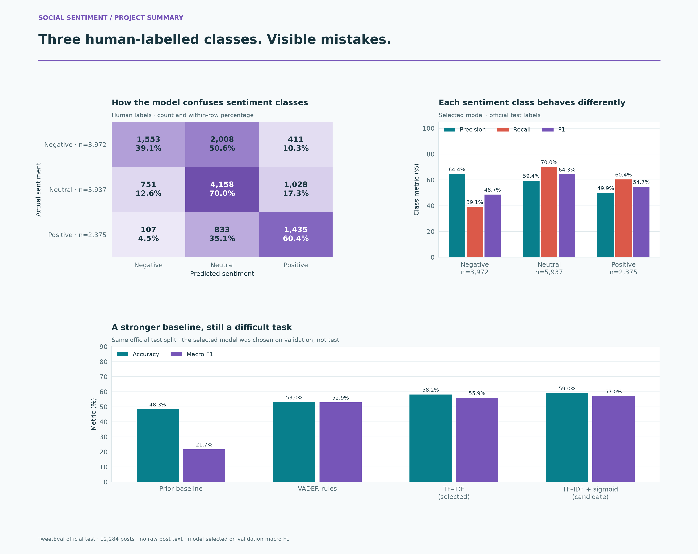
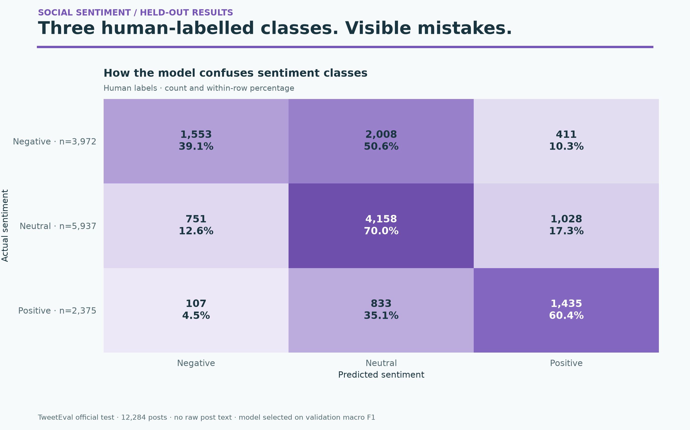
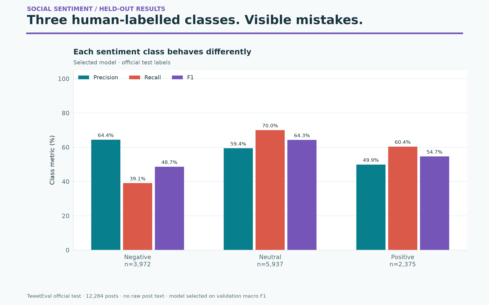
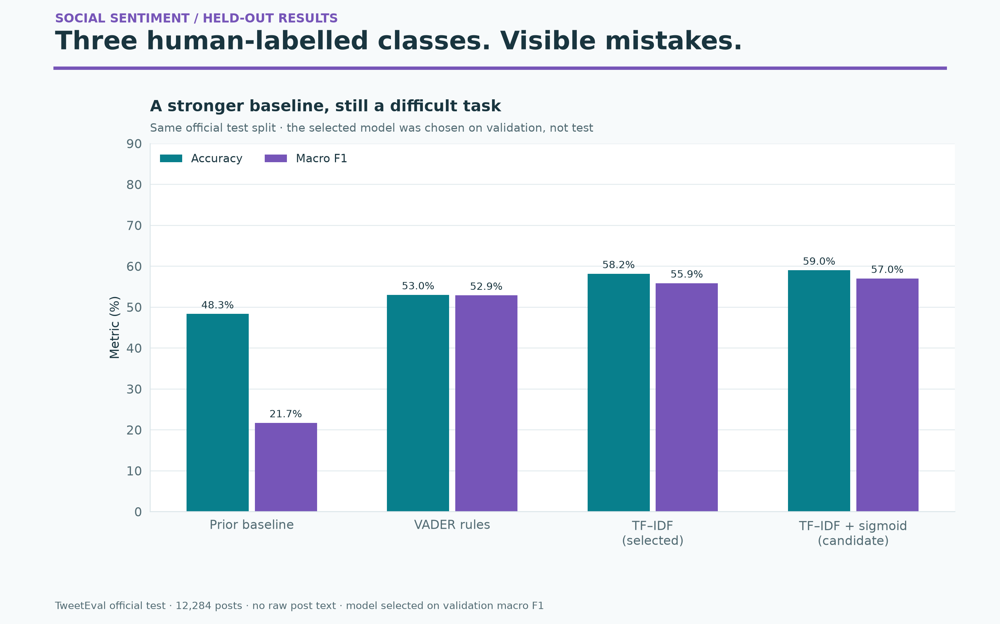

# Social sentiment — colorful results gallery

Three human-labelled classes. Visible mistakes.

TweetEval official test · 12,284 posts · no raw post text · model selected on validation macro F1



High-resolution PNGs and editable SVGs come from saved phase-two results. No model was retrained and no data was downloaded. These are descriptive benchmark results; model and policy choices were fixed on validation.

## Sentiment Confusion

Counts use all 12,284 official test posts. Cell percentages are normalized within actual class, not over all posts.



[PNG](sentiment_confusion.png) · [SVG](sentiment_confusion.svg)

## Sentiment Classes

Class support is shown under each label. F1 balances precision and recall; class imbalance makes aggregate accuracy incomplete.



[PNG](sentiment_classes.png) · [SVG](sentiment_classes.svg)

## Sentiment Models

All candidates are shown for transparency. TF–IDF was selected on validation macro F1 even though the calibrated candidate is stronger on this test; the test is not used to change that choice.



[PNG](sentiment_models.png) · [SVG](sentiment_models.svg)

## Reproduce

```bash
python plot_gallery.py
```

Use the pinned project requirements. Sources and hashes are in [chart-provenance.json](chart-provenance.json). Original phase-two outputs are unchanged.
