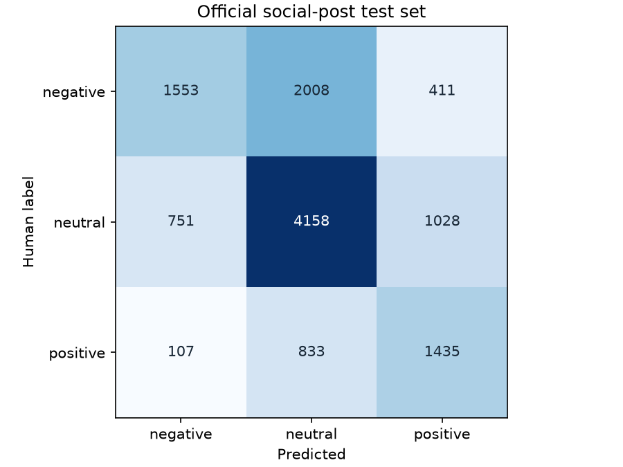
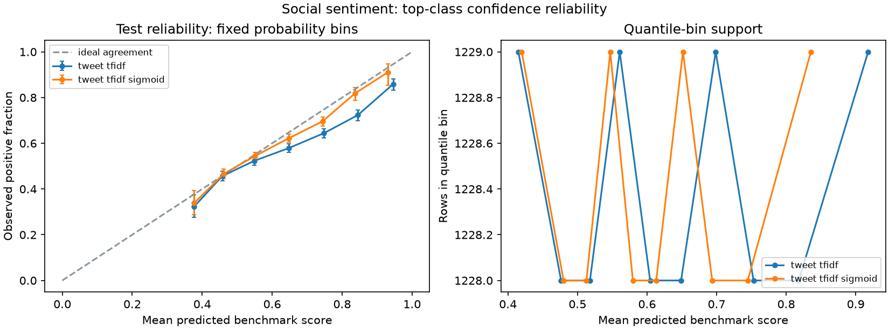

# Three-way social sentiment

Human-labelled TweetEval / SemEval-2017 social posts: negative, neutral, and positive.
All 12,284 official test rows are retained. Earlier-split overlaps are removed using text only;
33 earlier rows are excluded for overlap, duplication, or training-label ambiguity.
Training-only TF-IDF; an independent training reserve fits sigmoid calibration. Official validation selects the model.

**tweet_tfidf**: test accuracy 58.2%, macro F1 0.5587, macro recall 0.5652, log loss 0.8964.
VADER: accuracy 53.0%, macro F1 0.5288. Neutral is a genuine human-labelled class.

[Class support and Wilson intervals](class_intervals.json), [cluster bootstrap intervals](uncertainty.json),
[all metrics](metrics.csv), [validation stability](validation_stability.csv), [error source IDs](errors.csv),
and [review-to-tweet transfer](domain_shift.json) make results auditable.
[Diagnostic groups](diagnostic_groups.csv) use lexical heuristics; they cannot establish performance on human-labelled sarcasm or mixed sentiment.

This is historical general social sentiment, not a Black Friday survey. Authored examples are illustrations.
TweetEval's dataset licence is unspecified. Raw posts and error text remain local; the repository publishes hashes,
source row IDs, derived results, and a verified downloader. Models, calibration, and splits never tune on test labels.
This is a benchmark, with unknown author/topic/time overlap and no newly collected external validation.
